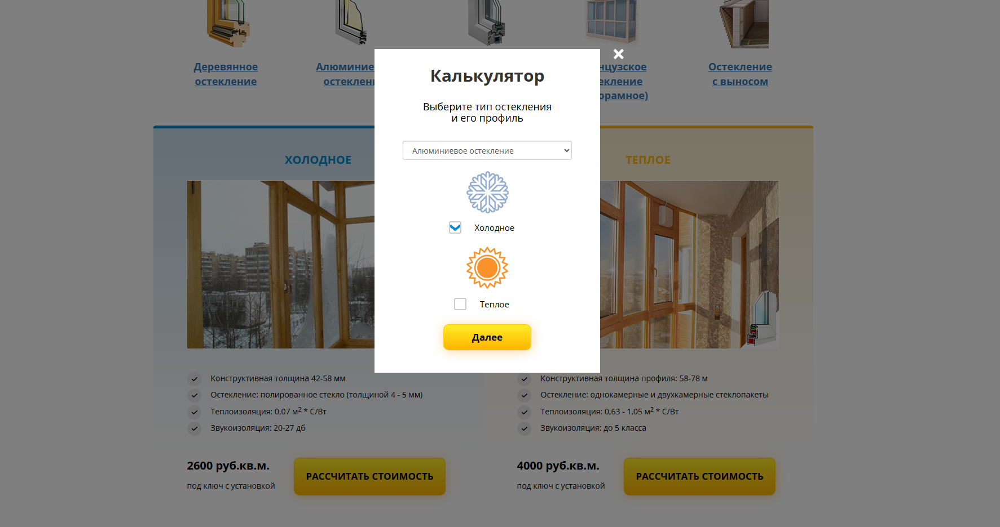
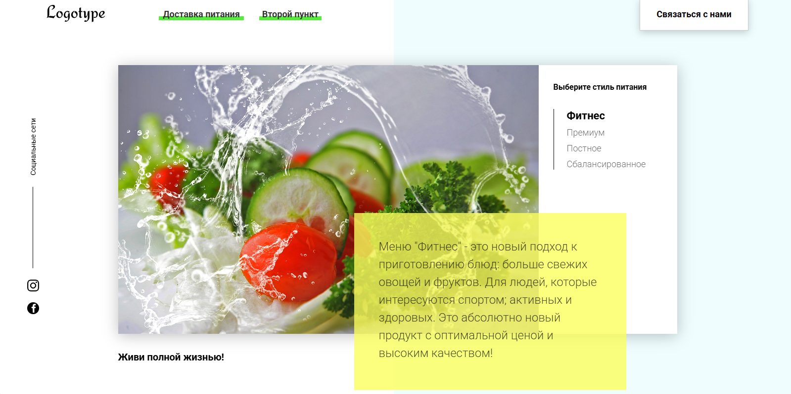
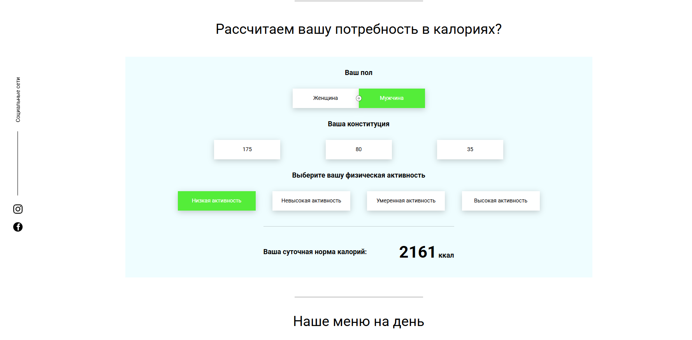

# 📚 Frontend Learning Track

> Мой персональный трекер изучения фронтенда.  
> 200+ коммитов, более 200 уроков, множество практических проектов.

Этот репозиторий — результат прохождения комплексного курса, где каждый теоретический блок закрепляется практикой.  
Здесь собрано всё: от основ JavaScript до React, Redux, инструментов сборки и деплоя.

---

## 🗺️ Содержание

Репозиторий организован по модулям:

### 📁 `Lessons`
Основы программирования, алгоритмы, синтаксис JavaScript, ООП, работа с DOM, асинхронность, AJAX, JSON, Fetch, Git, npm, Webpack, Babel.

### ⚛️ `React + Redux`
- React (компоненты, хуки, контекст, lifecycle)
- Redux (actions, reducers, thunk, middleware)
- **Redux Toolkit** + `createEntityAdapter`
- Архитектура приложений, FSM (Finite-state machine)

### 🍔 `Food_Study_Project`
Учебный проект по теме «Еда». Оптимизация, сборка, работа с API.

### 👨‍💼 `React project (Employees)`
Приложение для управления сотрудниками.  
*(активная разработка)*

### 🦸 `React project (Marvel)`
Проект по мотивам вселенной Marvel.  
FSM, управление состояниями, `setContent`.

### 🦸‍♂️ `Redux (Hero)`
Практика Redux на примере героев.  
`createEntityAdapter`, Toolkit, оптимизация.

### 🎁 `Bonus project`
Финальный бонус-проект. Сборка `dist`, таймеры, анимации.

### 🧪 `SandBox` и `React lesson (test)`
Эксперименты, тесты, черновики, адаптивная вёрстка.

---

## 🛠️ Охваченные технологии

🟨 JavaScript (ES6+)  
⚛️ React (хуки, контекст, lifecycle)  
🔄 Redux (Thunk, Toolkit, createEntityAdapter)  
📦 Webpack, Babel, npm  
🌐 AJAX, JSON, REST API, Fetch  
🔧 Git, GitHub   
🎨 HTML5, CSS3, адаптивная верстка  
🧠 ООП, алгоритмы, структуры данных  
📐 FSM (Finite-state machine)

---

## 📸 Примеры проектов из репозитория

*Лендинг компании по остеклению балконов*

*Калькулятор стоимости с выбором профиля*

*Сайт доставки здорового питания*

*Калькулятор суточной нормы калорий*

---
